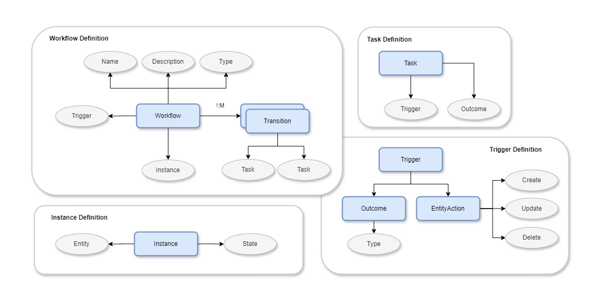
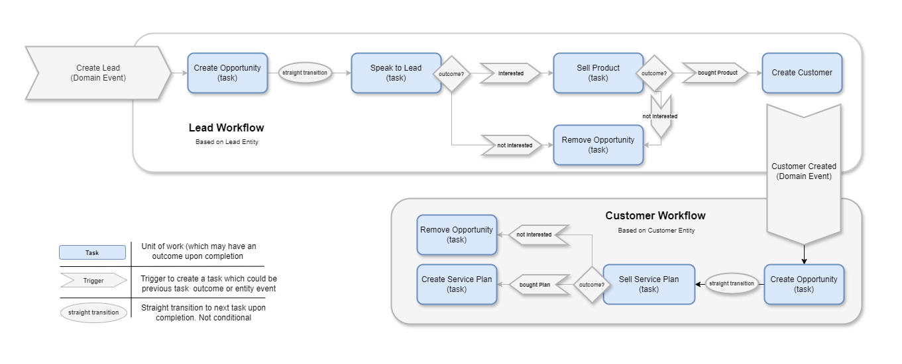

#  Abacus.Net v1.0.0
 
 
 

 

Simple Workflow framework in .Net
> Allows creating workflow templates with tasks transitions, triggered by outcomes of constituent tasks and entity actions linked to workflow (such as create, update or delete of linked entity).
### Design

### Concept
- `Workflow Template` defines a sequence of tasks linked to an action on entity of interest.
- `Task` is an unit of work that needs to be completed and can have an outcome associated upon completion.
- `Workflow Instance` is actual execution of workflow template triggered by an event on the instance of associated entity. Instance persists the current state of the workflow for the entity instance.
- Sequences of Tasks could be configured as multiple `transitions` with triggers driving transitions at different levels of branching.
- Tasks could be `triggered` by an `outcome` of previous task or a `domain event` on the workflow associated entity.

### Example Workflow

## Getting Started
### Installation
nuget add package SourceFlow.Net
 - dotnet add package Abacus.Net
 - dotnet add package Abacus.Net.SqlServer (to be released)
 - or your preferred storage

### Developer Guide
This comprehensive guide provides detailed information about the SourceFlow.Net framework, covering everything from basic concepts to advanced implementation patterns and troubleshooting guidelines.

Please click on [Developer Guide](https://github.com/CodeShayk/Abacus.Net/wiki) for complete details.
## Support
If you are having problems, please let me know by [raising a new issue](https://github.com/CodeShayk/Abacus.Net/issues/new/choose).

## License
This project is licensed with the [MIT license](LICENSE).

## Contributing
We welcome contributions! Please see our Contributing Guide for details.
- 🐛 Bug Reports - Create an [issue](https://github.com/CodeShayk/Abacus.Net/issues/new/choose)
- 💡 Feature Requests - Start a discussion
- 📝 Documentation - Help improve our [docs](https://github.com/CodeShayk/Abacus.Net/wiki)
- 💻 Code - Submit pull requests

## Credits
Thank you for reading. Please fork, explore, contribute and report. Happy Coding !! :)

